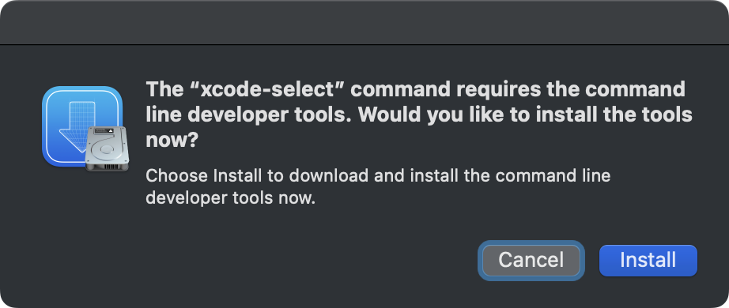

# Jira for Alfred

*Copyright 2023-2024 Caleb Evans*  
*Released under the MIT license*

This Alfred workflow allows you to quickly search for and open any Jira ticket
you have access to.

## Installation

To download the workflow, simply click one of the download links below. Please
note that only the Alfred 5 version has all the latest features.

[Download Jira for Alfred (Alfred 5)][workflow-download-alfred5]

[workflow-download-alfred5]: https://github.com/caleb531/jira-for-alfred/raw/main/Jira%20for%20Alfred%20(Alfred%205).alfredworkflow

### Command Line Tools

If you are installing the workflow for the first time, you may be prompted to
install Apple's Command Line Tools. These developer tools are required
for the workflow to function, and fortunately, they have a much smaller size
footprint than full-blown Xcode.

## Usage

## Configuration

In order to use the workflow, you must provide three bits of info:

1. The base URL of the Atlassian team (e.g.
   `https://yourcompany.atlassian.net`); any trailing slashes are ignored
2. The username of your Jira account
3. An access token for your Jira account ([*Atlassian account settings* > *Security* tab > **API tokens**][api-tokens])

You must input these configuration parameters when you first install the
workflow, and you can change them at any time.

[api-tokens]: https://id.atlassian.com/manage-profile/security/api-tokens

## Searching for issues

The main usage of the workflow is through the `jira` keyword. With it, you can search for a particular issue and perform different operations:

1. By default, open the issue page in your browser
2. Hold down the *Command* key to copy the key/ID of the issue (*e.g.*
   "ABC-123")
3. Hold down the *Option* key to copy the issue's URL
3. Hold down the *Shift* key to copy the issue summary (*e.g.* "Fix the thing")

## Restricting searches to specific projects

You can optionally restrict your search to one or more projects using the
**Restrict to Projects** configuration option within the workflow's settings).
This provides another way to cut down on the number of issues you might be
presented with.

To use it, enter a comma-separated list of project keys (e.g. if you want
tickets like ABC-123 and DEF-234, then enter "ABC, DEF" into the field). If you
leave the field blank, then you get the default behavior of searching across all
projects your Jira account has access to.

## Disclaimer

This project is not affiliated with Atlassian, and the Jira icons used in this
project is property of Atlassian.
